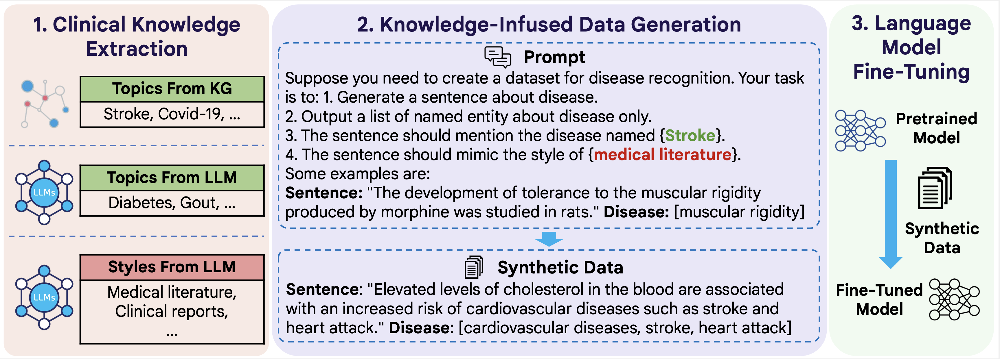

# ClinGen

This is the code for our paper [Knowledge-Infused Prompting: Assessing and Advancing Clinical Text Data Generation with Large Language Models](https://arxiv.org/abs/2311.00287), to appear on ACL 2024 Findings.

# Model Framework


## Dataset
### Generated Datasets
The original train/validation/test data, and the generated synthetic training data has been **uploaded** in Huggingface Dataset Hub (note that `KG` and `LLM` stands for two ways of incorporating external knowledge):

| Corpus | # Train | # Test | # Class | Task | Link-KG |  Link-LLM | 
| ------  | ------- | ----- | ----------- | ----------- | ----------- | ----------- |
| LitCovid | 24960 | 6238 | 7 | Text Classification | [litcovid](https://huggingface.co/datasets/ritaranx/clinical-synthetic-text-kg/tree/main/litcovid) | [litcovid](https://huggingface.co/datasets/ritaranx/clinical-synthetic-text-llm/tree/main/litcovid) 
| HOC | 3091 | 898 | 10 | Text Classification |  [hoc](https://huggingface.co/datasets/ritaranx/clinical-synthetic-text-kg/tree/main/hoc) |  [hoc](https://huggingface.co/datasets/ritaranx/clinical-synthetic-text-llm/tree/main/hoc)
| GAD | 4750 | 350 | 1 | Relation Extraction | [gad](https://huggingface.co/datasets/ritaranx/clinical-synthetic-text-kg/tree/main/gad) |  [gad](https://huggingface.co/datasets/ritaranx/clinical-synthetic-text-llm/tree/main/gad)
| CDR | 8431 | 2522 | 1 | Relation Extraction | [cdr](https://huggingface.co/datasets/ritaranx/clinical-synthetic-text-kg/tree/main/cdr) |  [cdr](https://huggingface.co/datasets/ritaranx/clinical-synthetic-text-llm/tree/main/cdr)
| ChemProt | 8793 | 10807 | 5 | Relation Extraction | [chemprot](https://huggingface.co/datasets/ritaranx/clinical-synthetic-text-kg/tree/main/chemprot) | [chemprot](https://huggingface.co/datasets/ritaranx/clinical-synthetic-text-llm/tree/main/chemprot)
| MedNLI | 11232 | 1422 | 3 | Natural Language Inference | [mednli](https://huggingface.co/datasets/ritaranx/clinical-synthetic-text-kg/tree/main/nli) | [mednli](https://huggingface.co/datasets/ritaranx/clinical-synthetic-text-llm/tree/main/nli)
| MEDIQA-NLI | - | 405 | 3 | Natural Language Inference |  [mediqa-nli](https://huggingface.co/datasets/ritaranx/clinical-synthetic-text-kg/tree/main/nli) | [mediqa-nli](https://huggingface.co/datasets/ritaranx/clinical-synthetic-text-llm/tree/main/nli)
| MEDIQA-RQE | 8588 | 302 | 2 | Natural Language Inference | [mediqa-rqe](https://huggingface.co/datasets/ritaranx/clinical-synthetic-text-kg/tree/main/mediqa_rqe) | [mediqa-rqe](https://huggingface.co/datasets/ritaranx/clinical-synthetic-text-llm/tree/main/mediqa_rqe)
| PUBHEALTH | 9804 | 1231 | 4 | Fact Verification | [pubhealth](https://huggingface.co/datasets/ritaranx/clinical-synthetic-text-kg/tree/main/pubhealth) | [pubhealth](https://huggingface.co/datasets/ritaranx/clinical-synthetic-text-llm/tree/main/pubhealth)
| HealthVer | 10591 | 1824 | 3 | Fact Verification | [healthver](https://huggingface.co/datasets/ritaranx/clinical-synthetic-text-kg/tree/main/healthver) | [healthver](https://huggingface.co/datasets/ritaranx/clinical-synthetic-text-llm/tree/main/healthver)
| MQP | 10 | 3033 | 2 | Sentence Similarity | [mqp](https://huggingface.co/datasets/ritaranx/clinical-synthetic-text-kg/tree/main/mqp) | [mqp](https://huggingface.co/datasets/ritaranx/clinical-synthetic-text-llm/tree/main/mqp)
| BC5CDR-Disease | 4882 | 5085 | 1 | Named Entity Recognition |  [bc5cdr-disease](https://huggingface.co/datasets/ritaranx/clinical-synthetic-text-kg/tree/main/bc5cdr_disease) |  [bc5cdr-disease](https://huggingface.co/datasets/ritaranx/clinical-synthetic-text-llm/tree/main/bc5cdr_disease)
| BC5CDR-Chemical | 4882 | 5085 | 1 | Named Entity Recognition | [bc5cdr-chemical](https://huggingface.co/datasets/ritaranx/clinical-synthetic-text-kg/tree/main/bc5cdr_chemical) | [bc5cdr-chemical](https://huggingface.co/datasets/ritaranx/clinical-synthetic-text-llm/tree/main/bc5cdr_chemical)
| NCBI-Disease | 5336 | 921 | 1 | Named Entity Recognition | [ncbi-disease](https://huggingface.co/datasets/ritaranx/clinical-synthetic-text-kg/tree/main/ncbi_disease) | [ncbi-disease](https://huggingface.co/datasets/ritaranx/clinical-synthetic-text-llm/tree/main/ncbi_disease)
| CHEMDNER | 14522 | 12430 | 1 | Named Entity Recognition | [chemdner](https://huggingface.co/datasets/ritaranx/clinical-synthetic-text-kg/tree/main/chemdner) |  [chemdner](https://huggingface.co/datasets/ritaranx/clinical-synthetic-text-llm/tree/main/chemdner)
| CASI | 5 | 100 | 6 | Attribute Extraction | [casi](https://huggingface.co/datasets/ritaranx/clinical-synthetic-text-kg/tree/main/casi) | [casi](https://huggingface.co/datasets/ritaranx/clinical-synthetic-text-llm/tree/main/casi)

**Note**: 
- Due to privacy constraint, we are not able to release the training set for MedNLI/MediQA-NLI.  
- `train.jsonl` stands for the synthetic training set (may contain noise)
- `train_few.jsonl` stands for the initial few-shot demonstrations
- `test.jsonl` stands for data from the test set


## Training Data Generation
First of all, please apply an OpenAI API key [here](https://openai.com/blog/openai-api), if you don't have one yet.
Then, replace the `YOUR_API_KEY` in `clingen.py` with your own API key.
Finally, run `bash run_clingen.sh` with your specified dataset name and keyword type.

## Questions?
Feel free to contact `ran.xu at emory.edu` for any questions regarding this repo. Please try to specify the problem with details so we can help you better and quicker!

## Citation
If you find this repository helpful, please kindly consider citing the corresponding paper. Thanks in advance!

```
@inproceedings{xu2024knowledge,
  title={Knowledge-Infused Prompting: Assessing and Advancing Clinical Text Data Generation with Large Language Models},
  author={Xu, Ran and Cui, Hejie and Yu, Yue and Kan, Xuan and Shi, Wenqi and Zhuang, Yuchen and Jin, Wei and Ho, Joyce and Yang, Carl},
  booktitle={Findings of the Association for Computational Linguistics: ACL 2024},
  year={2024}
}
```
